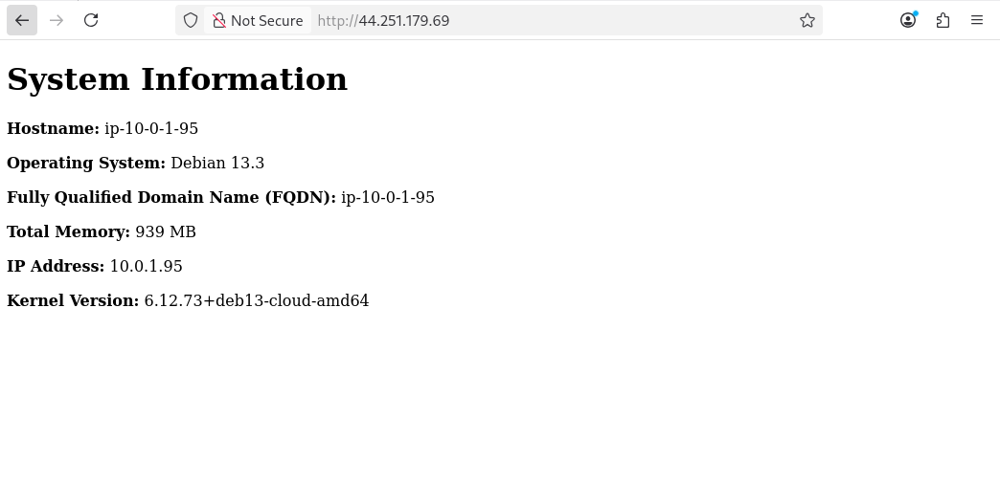

# 4640-in-class-wk7

 ## 1. Creating SSH Keys

### The following command creates a new SSH key pair that is used to connect to the EC2 instances.

ssh-keygen -t ed25519 -f ~/.ssh/aws

-t ed25519 creates a secure key type.

-f ~/.ssh/aws saves the key in the .ssh directory with the name "aws".

## 2. Importing and Deleting Keys (Provided Scripts)

### First, navigate to the scripts directory:

cd ~/intro-to-ansible-lab-files/scripts = go into the correct directory

### To import the public key into AWS:

./import_lab_key ~/.ssh/aws.pub = This uploads the public key so it can be attached to EC2 instances.

### To delete the key after the lab is complete:

./delete_lsb_key ~/.ssh/aws.pub = This removes the key from AWS as part of cleanup.

## 3. Terraform Commands

### Navigate to the terraform directory:

cd ~/intro-to-ansible-lab-files/terraform

### Initialize Terraform:
terraform init = This downloads the required providers and prepares the working directory.

### Format Terraform files:
terraform fmt = This ensures consistent formatting.

### Validate the configuration:
terraform validate = This checks the configuration for syntax errors.

### Preview the infrastructure changes:

terraform plan = This shows what resources will be created.

### Apply the configuration:
terraform apply = This provisions the AWS infrastructure.

### Destroy resources after completing the lab:
terraform destroy = This removes all AWS resources created during the lab.

## 4. Ansible Commands

### Navigate to the ansible directory:

cd ~/intro-to-ansible-lab-files/ansible

### Check playbook syntax:

ansible-playbook --syntax-check playbook.yml = This verifies the YAML syntax before running the playbook.

### Run the playbook:

ansible-playbook playbook.yml = This installs nginx, copies configuration files, deploys the template, and reloads the service.

### (Optional) Test connectivity to the servers:

ansible all -m ansible.builtin.ping = This confirms that Ansible can communicate with the managed nodes.

## 5. Screenshot of Rendered HTML Pag
Below is a screenshot of the rendered HTML page from one of the configured server.

## Resources
https://docs.ansible.com/projects/ansible/latest/collections/ansible/builtin/apt_module.html
https://docs.ansible.com/projects/ansible/latest/playbook_guide/playbooks_intro.html
https://docs.ansible.com/projects/ansible/latest/inventory_guide/intro_inventory.html
https://docs.ansible.com/projects/ansible/latest/playbook_guide/playbooks_handlers.html

